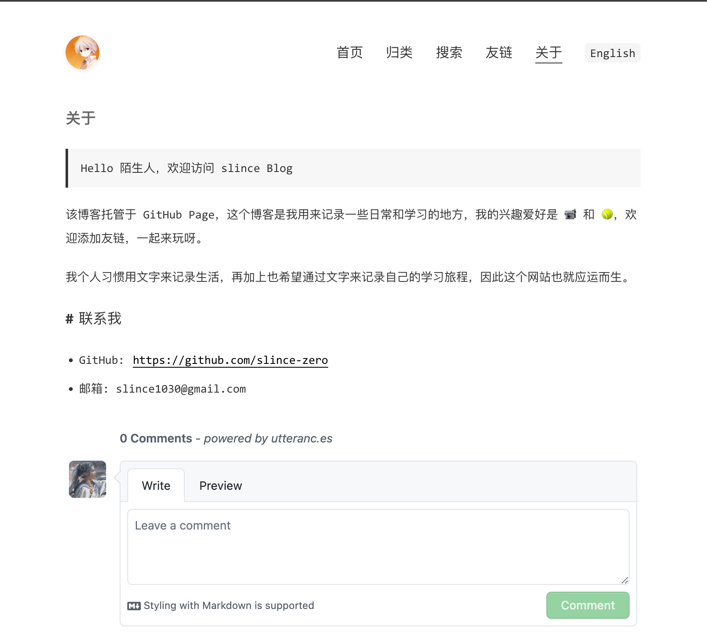

[](https://github.com/TMaize/tmaize-blog)
[](https://github.com/TMaize/tmaize-blog)
[](https://github.com/TMaize/tmaize-blog)

# 介绍

一款简洁纯净的 Jekyll 主题（主题资源请求<20KB），未引入任何框架，秒开页面，支持自适应，支持全文检索，支持夜间模式

## 预览
点击 [slince blog](slince-zero.github.io/) 查看预览





# 特点

- 简洁纯净的 Jekyll 主题（主题资源请求<20KB）
- 未引入任何框架，秒开页面
- 支持自适应布局
- 支持全文检索
- 支持深色模式
- 支持中英双语切换 (new 👻)
- 支持文章分类
- 代码语法高亮
- 支持评论（new 🤒）

## 本地开发

Windows 环境下推荐使用 WSL 安装 Ruby 环境：

```bash
apt install build-essential ruby ruby-dev
```

安装依赖：

```bash
gem install bundler
bundle install
```

启动本地服务：

```bash
bundle exec jekyll serve --watch --host=127.0.0.1 --port=8080
```

构建站点：

```bash
bundle exec jekyll build --destination=dist
```

## 配置

1. 如果使用自定义域名，请将`CNAME`文件中的内容替换为你的域名

2. 如果使用 GitHub 域名，请删除`CNAME`文件并将项目改名为`用户名.github.io`

3. 修改`pages/about.md`中的个人介绍

4. 根据注释修改`_config.yml`配置文件

5. 清空`_posts`目录下的示例文章

6. 替换`static/img/`下的 logo 和 favicon

## 使用
文章放在_posts目录下，命名为yyyy-MM-dd-xxxx-xxxx.md，内容格式如下

```bash
---
layout: mypost
title: 标题
categories: [分类1, 分类2]
---
文章内容，Markdown格式
```

文章资源放在posts目录，如文章文件名是2019-05-01-theme-usage.md，则该篇文章的资源需要放在posts/2019/05/01下,在文章使用时直接引用即可。当然了，写作的时候会提示资源不存在忽略即可

```bash


[xxx.zip 下载](xxx.zip)
```

## 致谢

感谢 [tmaize-blog](https://github.com/TMaize/tmaize-blog) 提供的模版

感谢 [OneDarkJekyll](https://github.com/mgyongyosi/OneDarkJekyll) 提供的暗色模式代码高亮配色
